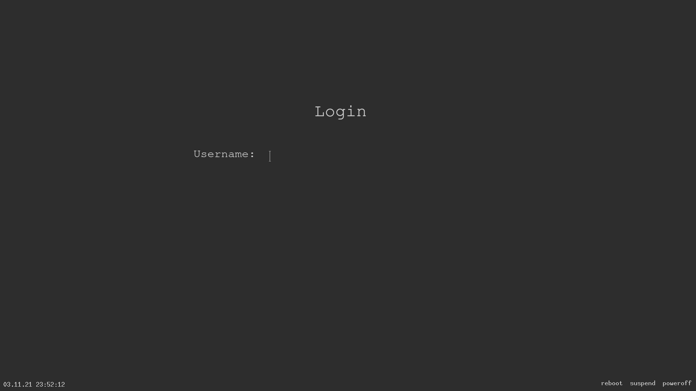

### xdm-simple

a simple xdm theme

> the install.sh script was written for arch-based systems (pacman)

#### restarting the current session
`sudo systemctl restart xdm-simple.service`

#### other

License: GPL
